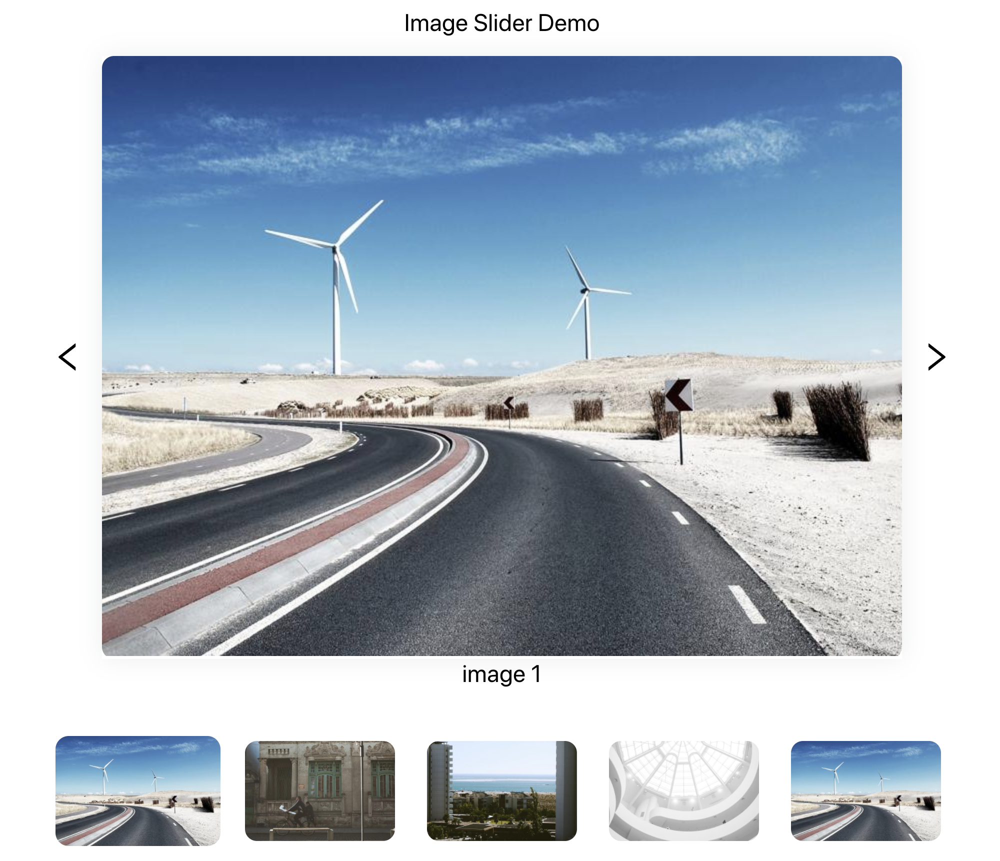

# React Simple Gallery

This simple carousel-style gallery is designed for showcasing your cherished images.

<p align="center">
  
</p>


## Install

```bash
npm install react-simple-gallery
```

## How to use

In your react file,

```javascript
import React from "react"
import { ImageSlider } from "react-simple-gallery"
import "react-simple-gallery/dist/index.css"

function demoComponent = (props) => {
  const data =[
    { title: "Image Title", src="url/to/your/Image" },
    { title: "Image Title", src="url/to/your/Image" },
  ]
  return (
    <div>
      <ImageSlider data={data} />
    </div>
  )
}


```

## Development

```bash
npm install
```